# Elastic Easy Install

## DISCLAIMER
The installation steps in this repo will help you setup elasticsearch and kibana to run in an unsafe environment.\
DO NOT USE THIS FOR A PRODUCTION ENVIRONMENT.

## Description
This repository provides files and instructions to simplify the installation and configuration of Elasticsearch v8.16 on Linux systems (tested on Ubuntu).

It also includes guidance on how to use the setup and what steps to take after installation.

If you have any questions or run into issues, feel free to reach out.

## Instructions
### Chapter 1: The beginning
You can easily download the files by downloading the whole repo as a zip file, which is the easiest option.

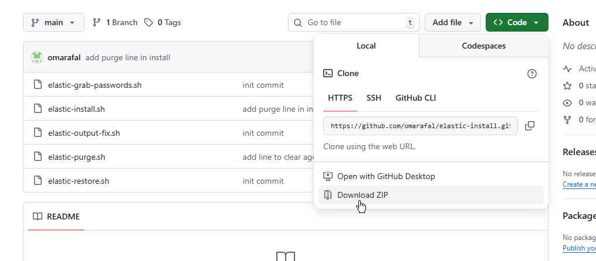

After the zip file is downloaded, you can unzip it using any tool you like, I personally prefer `7zip`.

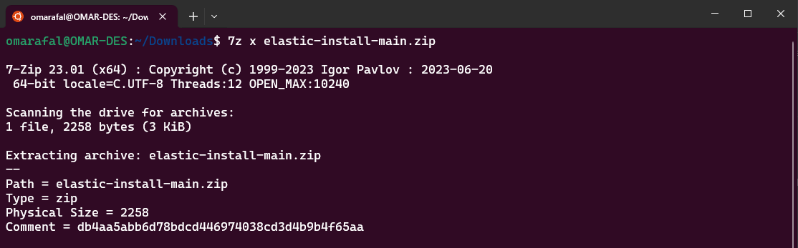

Perfect, you should now have the files you need.

First, check that the main install script is an executable.\

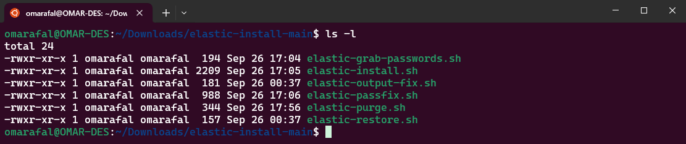

If for some reason it is NOT an executable, simply run `chmod +x ./elastic-install.sh`.

Now just simply run the script!\
NOTE: While it is running, do not do anything to it. Just leave it run and do not try to enter anything even if it asks for help and it is being held for a ransom. This is just a joke (not really..)

You can just enter your password if it asks for it because it needs to execute sudo privelage commands.

Run `./elastic-install.sh`

It will start by downloading the elasticsearch and kibana packages and then the magic starts.

Let me repeat myself. DO NOT UNDER ANY CIRCUMSTANCES ENTER ANYTHING OTHER THAN YOUR PASSWORD EVEN IF IT ASKS FOR IT.

### Chapter 2: I entered something even though I was warned multiple times not to, no like seriously it is crazy how I did not even read those words that are in capital that absolutely clearly warn me what not to do and I still did it. (optional)

  

Okay well, on a serious note. If you listened to the instructions and did like I said, just skip this section.

To the others that decided to ignore all my warnings and received an error on the password generation phase: I refuse to believe you exist.

Anyways, to fix this problem

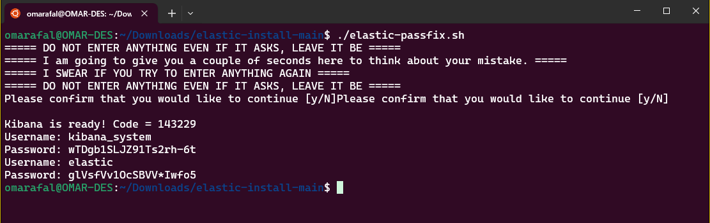

### Chapter 3: Onwards
If you have this output:

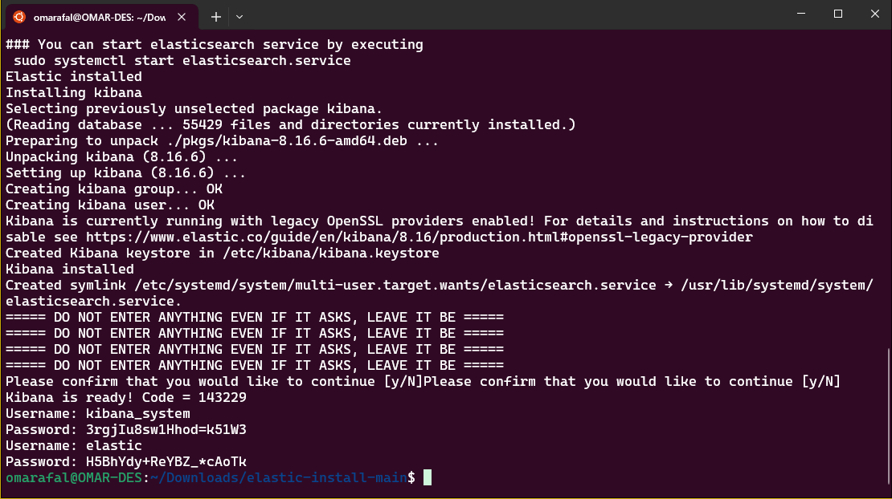

Congratulations! You have elasticsearch and kibana installed and probably, hopefully, already running.

If you notice in the output, a couple of usernames and passwords were spitout. Please keep note of these as we will need them.

Side note: if you cleared the screen and the passwords are gone, you can always see them again using `elastic-grab-passwords.sh`.

### Chapter 4: The Browser
This is where the fun begins.

You can now head over to your browser and enter `http://localhots:5601`. You should be presented with a Kibana page.

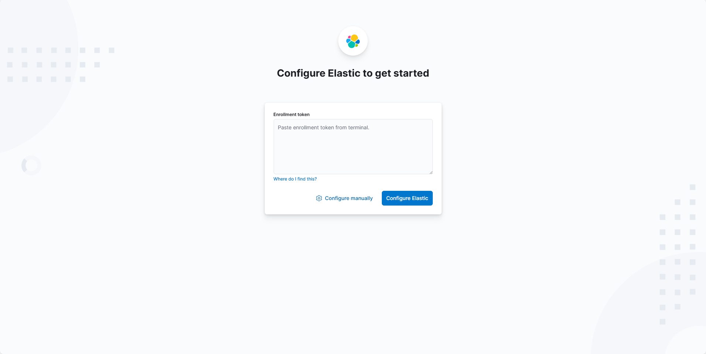

Click on "Configure manually".

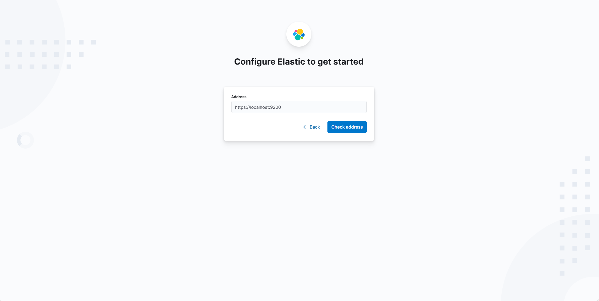

Can someone guess what our next step would be?\
Correct! Grab a bag of chips.

NO! Click on "Check address". You need to get yourself together and focus here. Sheesh.

If you have been following along so far, you should get this screen:

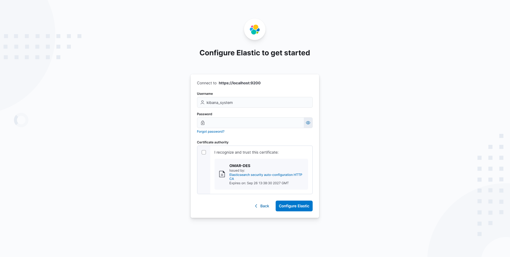

Remember the passwords we got in our console when we ran the script? Great! Go ahead and put the password for `kibana_system` and click on "I recognize and trust this certificate...".

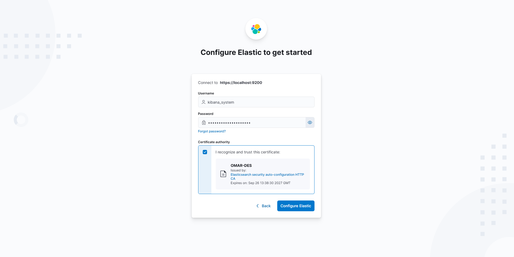

After you click on "Configure Elastic" you will be prompted to enter the code that was given to us at the beginning when we installed Kibana. The very first code.\
Go ahead and enter it and click on "Verify".

If all is good and well you should see this screen:

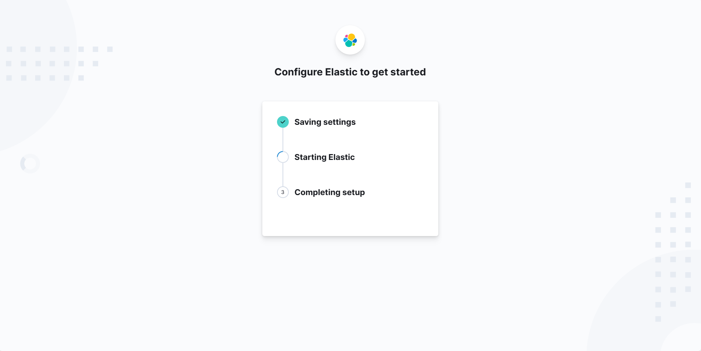

Once it finishes loading, you will be prompted to enter some credentials:

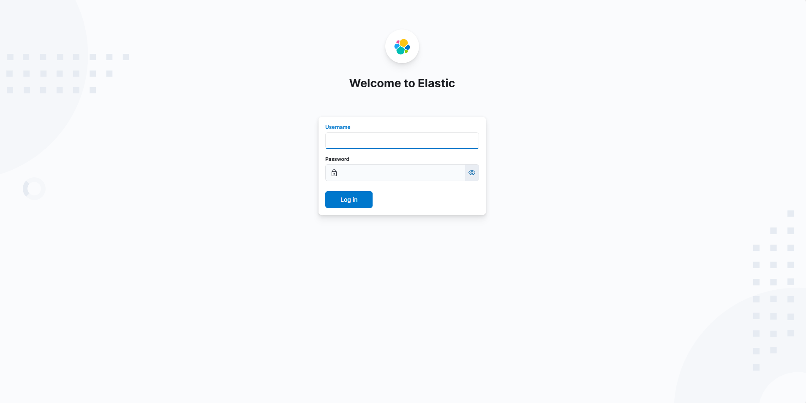

We are going to use the user `elastic`. Its password was also given when we configred Kibana. So use that to login.

You should now see this:

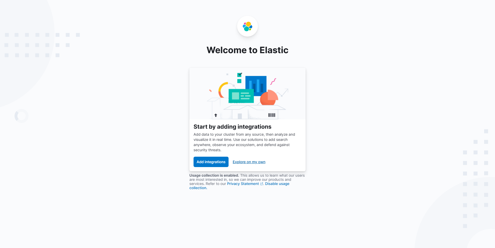

We are so close now.

Click on "Explore on my own".

Now, dear reader, you have fully running versions of elasticsearch and kibana on your system.\
You have two options from here on out:\
1) You can keep on reading and see how to setup your machine to be a fleet server.\
OR
2) You can try to figure out your way from here and setup the rest yourself.

I personally highly recommend going with the second option. Exploring on your own and figuring things out will always be the better option.

I already know most of you will choose the first option, you lazy human you.

### Chapter 5: I am a lazy person

There is no shame in that. Just embrace it.

  

To get started and add your machine as a fleet server, click on the "burger menu" in the top left and scroll all the way down to "Management" and click on "Fleet".

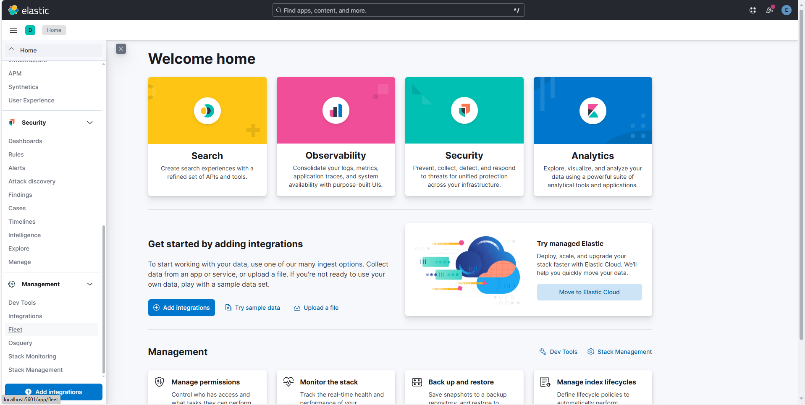

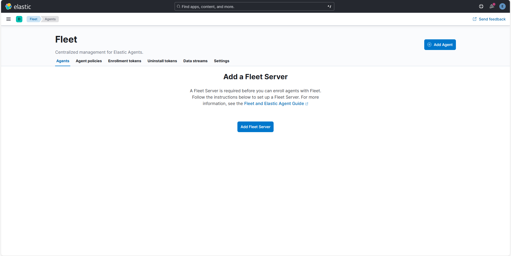

Next, click on "Add Fleet Server".

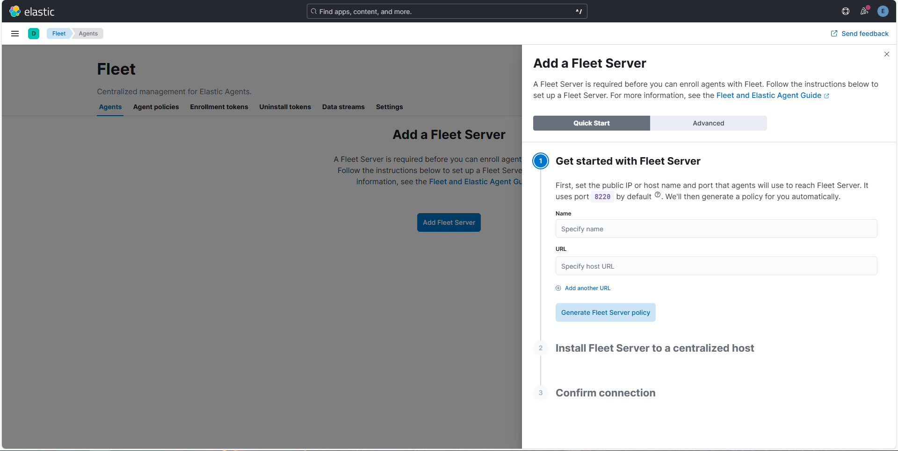

For the name, you can enter anything. I'll enter "Fleet-server-1".

For the host url, go and grab the IP address of your machine that elasticsearch is running on and place it there in this format:\
`https://IP:8220`\
Then click on "Generate Fleet Server policy".

Once you do that, you will be given multiple options to install the fleet server. So choose the OS you want to install the server on.

Since this guide uses Ubuntu, I'll choose the Linux tar option.

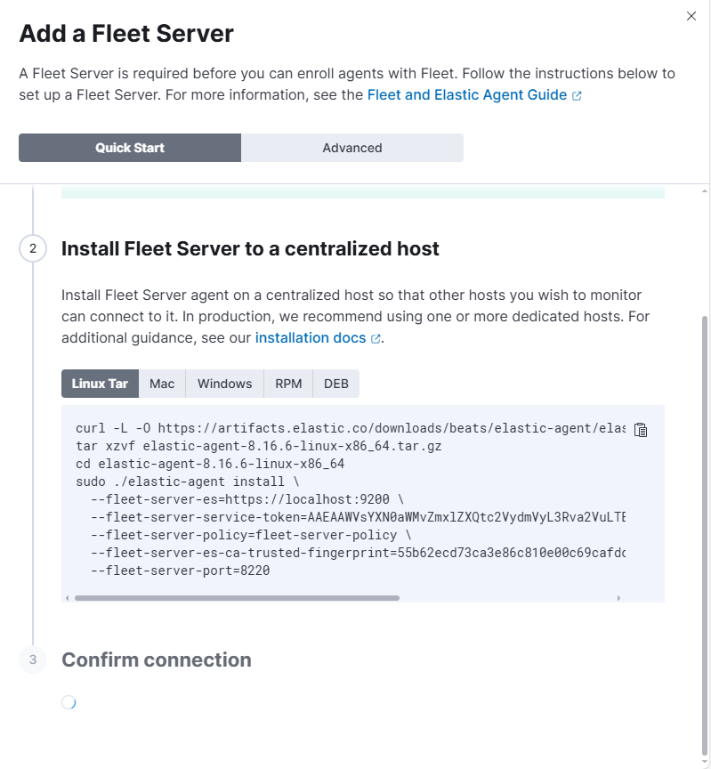

Just copy the commands and paste them in the terminal.

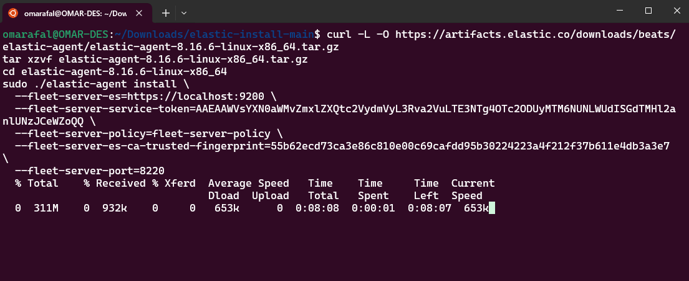

And leave it to finish.

If all goes well, you should now have your fleet server installed.

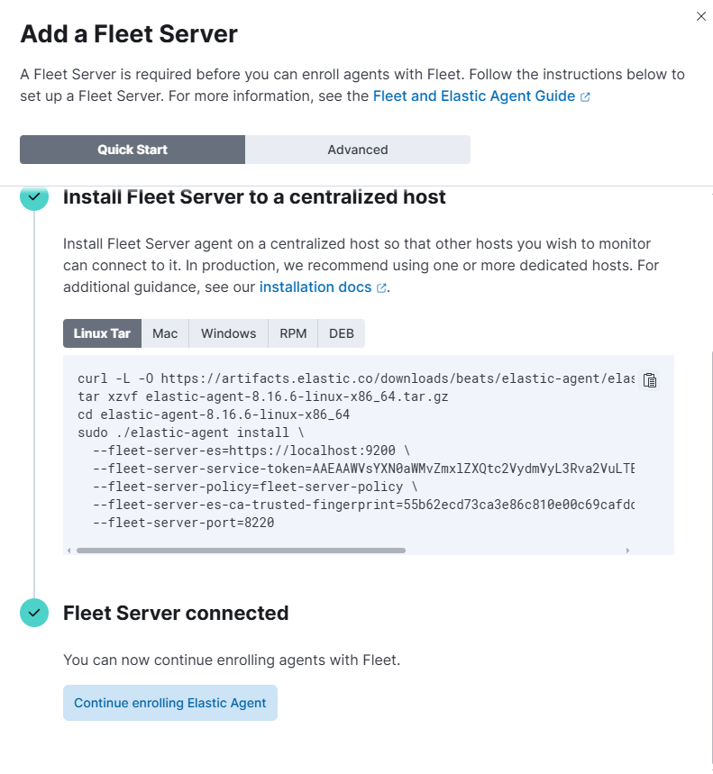

### Chapter 6: Logs output fix (optional)
There is a common problem I saw while installing everything, especially after adding some other agents and waiting for them to send their logs to the fleet.\
This problem is that, those logs never get sent at all!

To check for this, head over to the "Settings" tab under "Fleet".

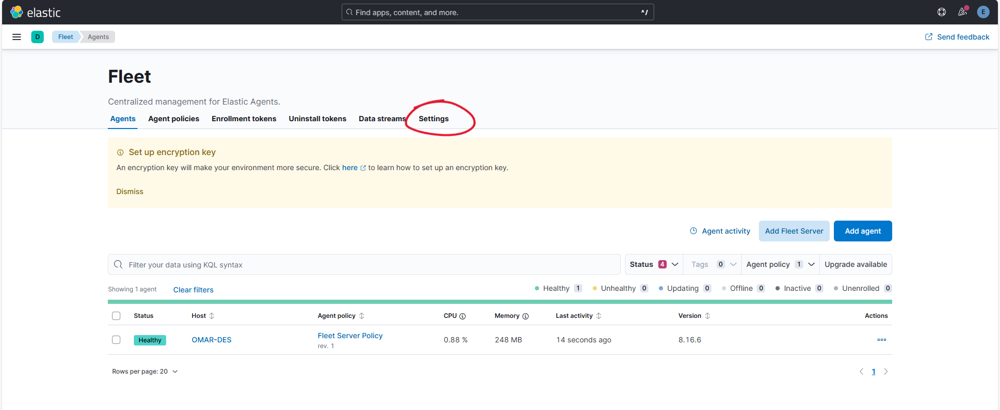

And yeah, I seem to be having this problem.

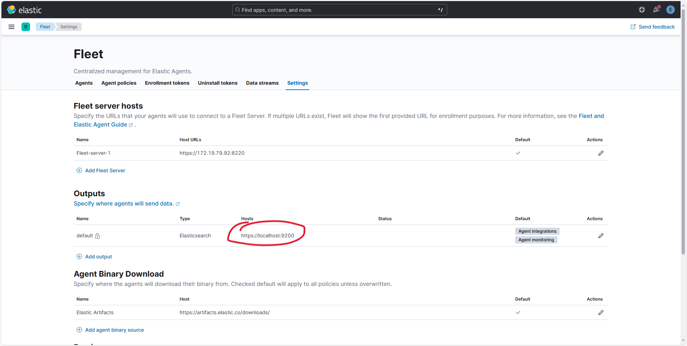

Notice under the "Outputs" tab I have it set to `localhost` which is not what we want. This means that any agent that will be added to have this configuration literally set to that. So each agent will try to send its logs and metrics over to `localhost` meaning themselves.

To fix this you can either click on the pen symbol right beside it and change it from `localhost` to the IP address of your device.

Sometimes that fails to work and it shows you a message like "This output is managed outside of Fleet".

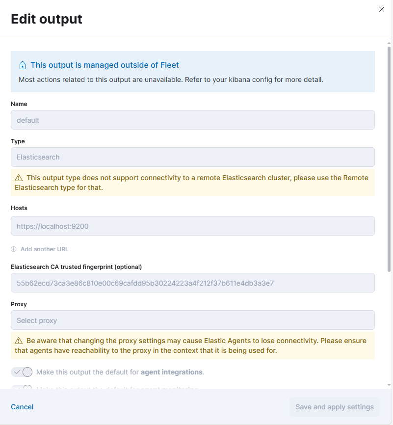

Another way to fix this is to headover to the scripts I gave you and run `./elastic-output-fix.sh`.

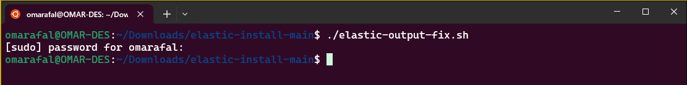

Now, just wait for Kibana to fully restart and check the "Outputs" again.

### Chapter 7: The End
If you run into any issue or something goes wrong for you, please feel free to reach out to me and I'll do the best I can to help you out.